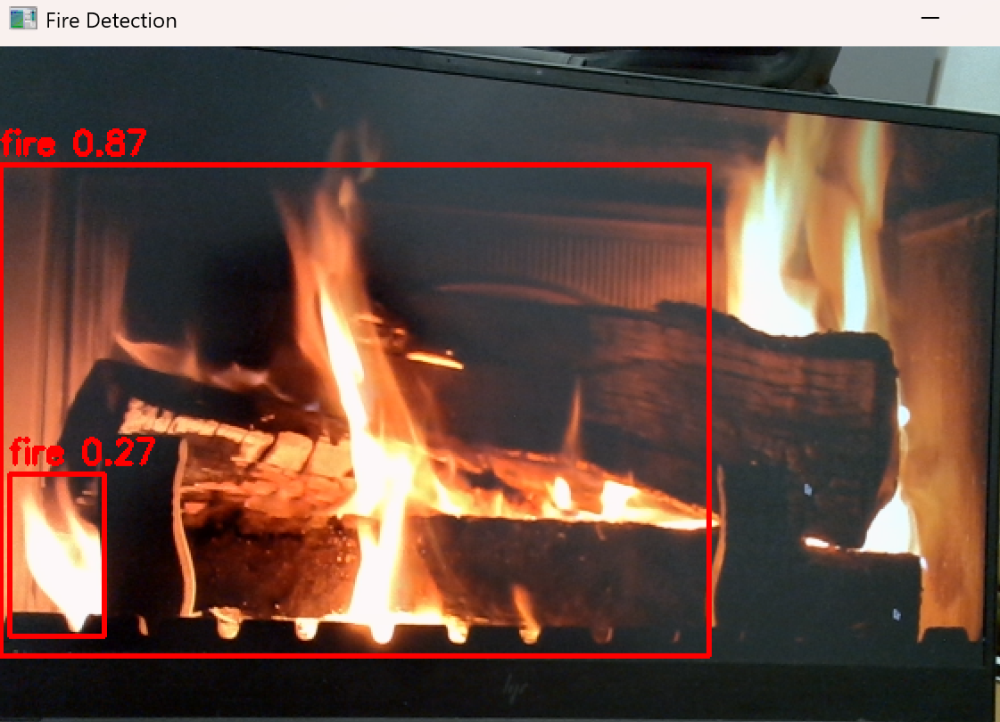

# Fire & Smoke Detection — G.E.R.O Vision Module

Real-time fire and smoke detection built for robotic engineering. This module is part of the **G.E.R.O** (General Emergency Response Operations) vision stack and will be deployed as a tool integrated with the **Unitree G1 EDU humanoid robot**, operating as a security robot at **Paris Charles de Gaulle Airport**.



---

## Context

The Unitree G1 EDU carries a USB webcam on its head. This module runs continuously, detects fire and smoke in the camera feed, and triggers an alert that is forwarded to the robot's agent decision layer — enabling the G1 to autonomously respond to fire hazards in a public environment.

**Deployment targets:**
- **Phase 1 — Laptop + USB webcam** (current): development and validation
- **Phase 2 — Unitree G1 EDU (Jetson Orin NX)**: production, headless, CUDA-accelerated

---

## Model

[`SalahALHaismawi/yolov26-fire-detection`](https://huggingface.co/SalahALHaismawi/yolov26-fire-detection) — YOLOv26-S, 3 classes: `fire / smoke / other`. Weights are downloaded automatically from HuggingFace at first run.

---

## Project structure

```
fire-detection/
├── main.py                    # entrypoint
├── config/
│   ├── base.yaml              # laptop defaults
│   └── g1.yaml                # G1 robot overrides (headless, CUDA, cam index 2)
├── detection/
│   ├── config.py              # YAML loading and merging
│   ├── camera.py              # OpenCVCamera + RealSenseCamera + CameraFactory
│   ├── model.py               # model loading, inference, annotation
│   ├── alert.py               # AlertManager + pluggable handlers
│   └── detector.py            # main detection loop
├── scripts/
│   ├── find_cameras.py        # scan cv2 indexes 0-9
│   └── export_tensorrt.py     # export best.pt → best.engine (run on Jetson)
└── docs/
    └── fire_detection_screenshot.png
```

---

## Quick start

**With uv (recommended):**
```bash
uv run main.py
```

**With standard pip:**
```bash
pip install -r requirements.txt
python main.py
```

**G1 robot (headless, CUDA):**
```bash
uv run main.py -c config/g1.yaml
```

**Override camera or disable window:**
```bash
uv run main.py --source 1 --no-display
```

---

## Alert system

Two independent alert managers run in parallel — one for `fire`, one for `smoke` — each with its own sliding window and cooldown:

| Class | Trigger frames | Cooldown |
|-------|---------------|----------|
| fire  | 2             | 30 s     |
| smoke | 5             | 15 s     |

Alert handlers are pluggable (`console` → `webhook` → `agent`). The `AgentToolHandler` stub is the integration point for the G1 agent tool call.

---

## Migration to Jetson Orin NX (G1 robot)

See [`docs/g1_migration.md`](docs/g1_migration.md) for the full step-by-step guide.
